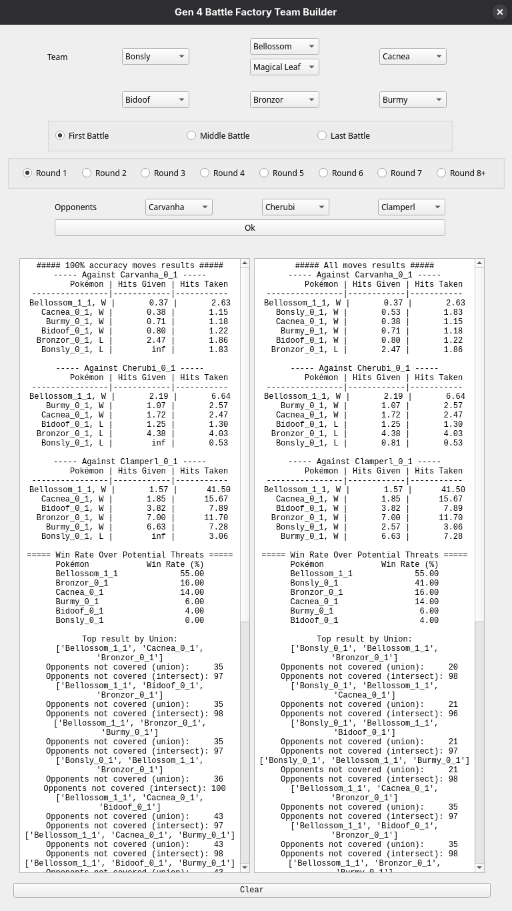
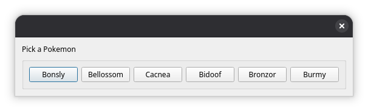
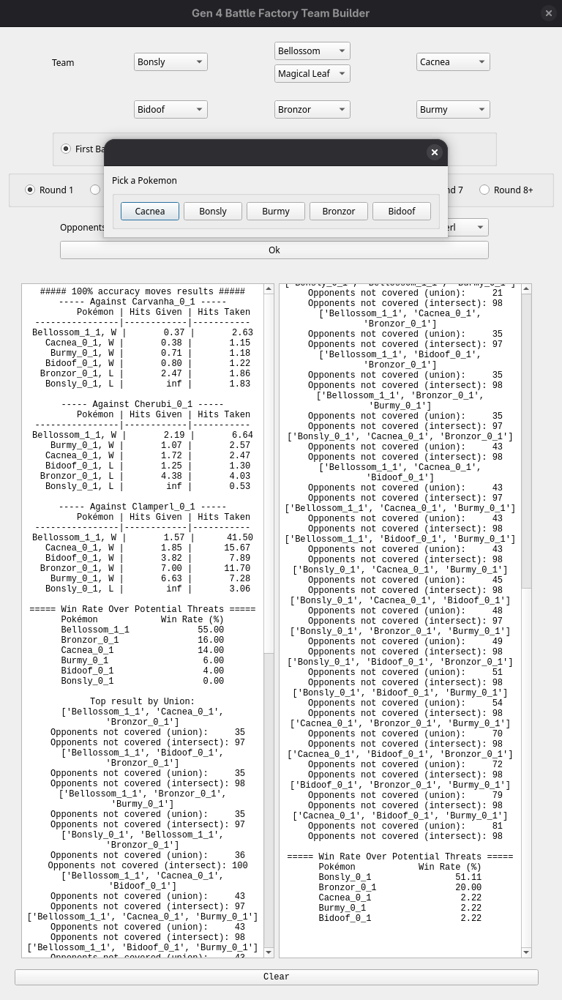
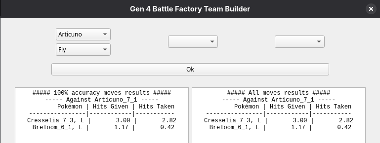

# Gen4 Battle Factory Team Builder

A PyQt5-based analysis tool for optimizing Pokémon matchups via deterministic damage-based heuristics. The system evaluates candidate Pokémon against filtered opponent pools to guide real-time decision-making during Battle Frontier runs.

## Core Features

- __Strategic Input__: Team options, facility hints, and round stages.

- __Comparative Analytics__: Computes matchup win percentages and evaluates trade strength using strict and relaxed accuracy models.

- __Heuristic Engine__: Utilizes a hits-dealt vs. hits-taken damage model to provide data-driven insights.

__Technical Insight__: While deterministic heuristics are effective for rapid decision-making, future iterations will integrate item and ability modifiers to improve model accuracy.

## Tech Stack

- Python
- PyQt5
- Cattrs

# Getting Started

## Step 1: Environment Setup

Ensure you are in the project root directory and create a virtual environment to isolate the project dependencies.

### Create the virtual environment

```bash
python3 -m venv .venv
```

### Activate the environment

```bash
source .venv/bin/activate
```

## Step 2: Install Dependencies

Install all required libraries specified in the `requirements.txt` file.

### Install dependencies

```bash
pip install -r requirements.txt
```

## Step 3: Execution

Run the analyzer to begin processing battle data and interacting with the simulation results.

```bash
python main.py
```

## Performance Note:
Initialization involves processing large datasets on the main thread, which may cause temporary UI latency. I plan on architecting a background worker solution to ensure interface responsiveness as new battle data is integrated.

## Interface & Analytics
Here is the analyzer in action, processing win-rate data to provide actionable team-building insights:

**

*Figure 1: Main interface with win-rate calculations.*



*Figure 2: Selection window for dynamic team member updates.*



*Figure 3: Updated analysis panel with fresh insights.*



*Figure 4: Targeted testing against specific opponents.*
